## [Table of Contents](#table-of-contents)
* [Purpose](#purpose)
* [User Experience Design (UX)](#user-experience-design)
  * [Epics and User Stories](#epics-and-user-stories)
* [Agile Methodology](#agile-methodology)     
* [Design](#design)
  * [Wireframes](#wireframes)
  * [Colour Scheme](#color-scheme)
  * [Typography](#typography)
  * [Database Schema](#database-schema)
* [Business Model](#business-model)
  * [Facebook Page](#facebook-page)
* [Features](#features)
  * [Home Page](#home-page)
  * [Navigation](#navigation)
  * [Products](#products)
  * [Reviews](#reviews)
  * [Contact](#contact)
  * [Shoping Bag](#shoping-bag)
  * [Checkout](#checkout)
  * [Messages](#messages)
  * [Wishlist](#wishlist)
  * [Footer](#footer)
  * [Login/Logout/Register](#login-logout-register)  
  * [Administration](#administration)
* [Technologies Used](#technologies-used)
* [Libraries](#libraries)
* [Security and Authentification](#security-and-authentification)
* [Testing](#testing)    
* [Bugs](#bugs)
* [Credits](#credits)
* [Deployment](#deployment)
* [Credits](#credits)
   * [Code and Tutorials](#code-and-tutorials)
* [Acknoledgements](#acknowledgements)

# AJK FURNITURE SITE
## Purpose:
### Goal:
#### To allow individuals customers to visit the site view the furniture suites available and purchase via an online payment system.
#### To provide a visual and interactivity so that the user will be able to fulfil their objectives.
This is a furniture suite shopping site where customers can view furniture suites for various rooms. They can also view the individual details and view the reviews given by previous customers. They can register as site members and view previous purchases as well as make their own reviews. They can also create a shopping bag and arrange online payment.

### Business Goals:

The main goal of this project is to give a user the ability to make bookings. User should also should also be able to make updates to their account in via their account. The user should also be able to give a review.

### Target Audience:

The target audience are customers that they feel would benefit with the ease from shopping online, be able to view the suites visually as well as look at the reviews from previous customers.

* [Back to contents](#table-of-contents)

The live website can be found [here](https://ajk-furniture.herokuapp.com/).

*** 
## User Experience Design

## Agile Methodology

### Github Project Board

* Although not specially designed for this the project board in github works well enabling me to track my user stories.
* This enabled me to manage the project by breaking it up into several phases.
* Once the project had started it allowed me to cycle through the process to planning, executing and evaluating.
* The framework used is the Kanban board - a form of visual project management.

### Epics and User Stories

* #### Epic 1 - Home Page (Milestone 1)
    |  User Story ID  |    User Type   |  Content  |   App   | MoSCoW Label |
    | --------------- | -------------- | --------- | --------| -------------|
    | [#1](https://github.com/andyk8872/p5-ecommerce/issues/1)  | As a customer | As a user I can view the site so that I can determine the function/purpose of the site | Home | Must Have |
    |  [#2](https://github.com/andyk8872/p5-ecommerce/issues/2)  | As a customer | As a user I can traverse the site so that I can fulfil my aims | Home | Must Have |
* #### Epic 2 - Products (Milestone 1)
    |  User Story ID  |    User Type   |  Content  |   App   | MoSCoW Label |
    | --------------- | -------------- | --------- | --------| -------------|
    [#3](https://github.com/andyk8872/p5-ecommerce/issues/3)  | As a customer | As a user I can view the products so that I can view their description, price and image | Products | Must Have
    [#4](https://github.com/andyk8872/p5-ecommerce/issues/4)  |  As a customer | As a user I can search the products so that view and compare descriptions, prices and types. | Products | Must Have
    [#8](https://github.com/andyk8872/p5-ecommerce/issues/8)  | As a customer | As a user I can view the details of each product and add it to my shopping cart so that get a more detail on the product and add to my cart to possibly purchase at a later stage | Products | Must Have
* #### Epic 3 - Profile/Account (Milestone 1)
    |  User Story ID  |    User Type   |  Content  |   App   | MoSCoW Label |
    | --------------- | -------------- | --------- | --------| -------------|
    [#5](https://github.com/andyk8872/p5-ecommerce/issues/5)  | As a customer | As a user/administrator I can register an account so that I can manage my activities related to my account. | Profiles | Must Have
    [#6](https://github.com/andyk8872/p5-ecommerce/issues/6)  | As a customer | As a user/administrator I can receive an email so that I can confirm my identity | Profiles | Must Have
    [#7](https://github.com/andyk8872/p5-ecommerce/issues/7)  | As a customer | As a user/administrator I can reset my password so that I can retrieve my account if password forgotten | Profiles | Must Have
* #### Epic 4 -  Shopping Cart (Milestone 1)
    |  User Story ID  |    User Type   |  Content  |   App   | MoSCoW Label |
    | --------------- | -------------- | --------- | --------| -------------|
    [#9](https://github.com/andyk8872/p5-ecommerce/issues/9)  | As a customer | As a user I can view the shopping cart so that I can see what products I have, the quantity and the total/individual cost | Cart | Must Have
    [#10](https://github.com/andyk8872/p5-ecommerce/issues/10)  | As a customer | As a user I can update the shopping cart so that I can add, subtract or remove products before going to checkout. | Cart | Must Have
    [#11](https://github.com/andyk8872/p5-ecommerce/issues/11)  | As a customer | As a customer I can view a summary of my shopping cart including the amounts so that when I proceed to payment I know what I am buying and for how much | Cart | Must Have
* #### Epic 5 -  Checkout (Milestone 1)
    |  User Story ID  |    User Type   |  Content  |   App   | MoSCoW Label |
    | --------------- | -------------- | --------- | --------| -------------|
    [#12](https://github.com/andyk8872/p5-ecommerce/issues/12)  | As a customer | As a user I can fill in my delivery and payment details so that I can arrange delivery details a pay for the items in my shopping bag. | Checkout | Must Have
    [#13](https://github.com/andyk8872/p5-ecommerce/issues/13)  | As a customer | As a user I can view the shopping cart so that **I can see what I am looking to purchase ** | Profiles | Must Have
    [#14](https://github.com/andyk8872/p5-ecommerce/issues/14)  | As a customer | As a user I can enter my credit card details and delivery details so that arrange payment and delivery of purchases | Checkout | Must Have
    [#15](https://github.com/andyk8872/p5-ecommerce/issues/15)  | As a customer | As a user I can receive confirmation of my order so that I know my purchase has been processed and payment received | Checkout | Must Have
* #### Epic 6 -  Reviews (Milestone 2)
    |  User Story ID  |    User Type   |  Content  |   App   | MoSCoW Label |
    | --------------- | -------------- | --------- | --------| -------------|
    [#16](https://github.com/andyk8872/p5-ecommerce/issues/16)  | As a customer | As a user I can see what previous customers thought of products so that I can make an informed choice | Reviews | Could Have
    [#22](https://github.com/andyk8872/p5-ecommerce/issues/22)  | As a customer | As a user I can go from page to page so that I can more easily view the reviews| Reviews | Must Have
    [#17](https://github.com/andyk8872/p5-ecommerce/issues/17)  | As a customer | As a member/admin I can make, edit, and delete my own reviews so that share my current opinions | Must Have
* #### Epic 7 -  Contact (Milestone 2)
    |  User Story ID  |    User Type   |  Content  |   App   | MoSCoW Label |
    | --------------- | -------------- | --------- | --------| -------------|
    [#18](https://github.com/andyk8872/p5-ecommerce/issues/18)  | As a customer | As a user I can contact the eccomerce owners so that express concerns and seek direct information | Checkout | Must Have
* #### Epic 8 -  Wishlist (Milestone 2)
    |  User Story ID  |    User Type   |  Content  |   App   | MoSCoW Label |
    | --------------- | -------------- | --------- | --------| -------------|
    [#19](https://github.com/andyk8872/p5-ecommerce/issues/19)  | As a customer | As a user I can create a wishlist so that come back and view products that I might be interested in | Wishlist | Should Have
* #### Epic 9-  Footer (Milestone 2)
    |  User Story ID  |    User Type   |  Content  |   App   | MoSCoW Label |
    | --------------- | -------------- | --------- | --------| -------------|
    [#20](https://github.com/andyk8872/p5-ecommerce/issues/20)  | As a customer | As a user I can link in to social media and other information relevant to the ecommerce site so that find information and contact the company | Footer | Must Have
* #### Epic 10 -  Newsletter (Milestone 2)
    |  User Story ID  |    User Type   |  Content  |   App   | MoSCoW Label |
    | --------------- | -------------- | --------- | --------| -------------|
    [#21](https://github.com/andyk8872/p5-ecommerce/issues/21)  | As a customer | As a user I can receive a newsletter so that keep upto date on products and offers | Newsletter | Could Have
* #### Epic 11 -  Confirmation Delete (Milestone 2)
    |  User Story ID  |    User Type   |  Content  |   App   | MoSCoW Label |
    | --------------- | -------------- | --------- | --------| -------------|
    [#24](https://github.com/andyk8872/p5-ecommerce/issues/24)  | As a customer | As a user I can have a cofirmation delete optionso that I can have peace of mind when using the site if I make a mistake | All | Could Have
* #### Epic 12 -  Privacy Policy (Milestone 2)
    |  User Story ID  |    User Type   |  Content  |   App   | MoSCoW Label |
    | --------------- | -------------- | --------- | --------| -------------|
    [#24](https://github.com/andyk8872/p5-ecommerce/issues/23)  | As a customer | As a user I can view the legal privacy policy so that I know my legal rights in relation to information privacy laws | All | Could Have
* #### Epic 13 - Account Management  (Milestone 3)
    |  User Story ID  |    User Type   |  Content  |   App   | MoSCoW Label |
    | --------------- | -------------- | --------- | --------| -------------|
    [#27](https://github.com/andyk8872/p5-ecommerce/issues/27)  | Administratior | As a admin I can manage products so that I can add/delete or update then where neccessary | All | Must Have
    [#28](https://github.com/andyk8872/p5-ecommerce/issues/28)  | Adiministrator | As a admin I can manage the users accounts so that I can make any changes if neccessary | All | Must Have
    [#29](https://github.com/andyk8872/p5-ecommerce/issues/29)  | Administrator | As a admin I can view the messages reveived via the contact app so that I can reply to customers queries | All | Must Have
    [#30](https://github.com/andyk8872/p5-ecommerce/issues/30)  | Administrator | As a admin I can delete reviews so that I can make sure all reviews are appropriate | All | Must Have
* #### Epic 14 - Facebook  (Milestone 3)
    |  User Story ID  |    User Type   |  Content  |   App   | MoSCoW Label |
    | --------------- | -------------- | --------- | --------| -------------|
    [#25](https://github.com/andyk8872/p5-ecommerce/issues/25)  | Administratior | As a user I can follow AJK Furniture on social media so that I can see what new suites and deals are on offer. | All | Must Have
  * #### Epic 14 - Authentification  (Milestone 3)
    |  User Story ID  |    User Type   |  Content  |   App   | MoSCoW Label |
    | --------------- | -------------- | --------- | --------| -------------|
    [#26](https://github.com/andyk8872/p5-ecommerce/issues/26)  | Administratior | As a user I can register an account so that I can store my personal details and preferences. | All | Must Have

* [Back to contents](#table-of-contents)  

***

## Design
### Wireframes:

Desktop-Wireframes
 
* This is the 'home page' design in the desktop. 
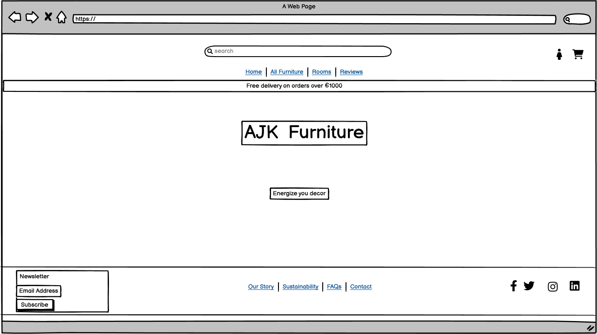 
* This is the 'products' design in the desktop. 
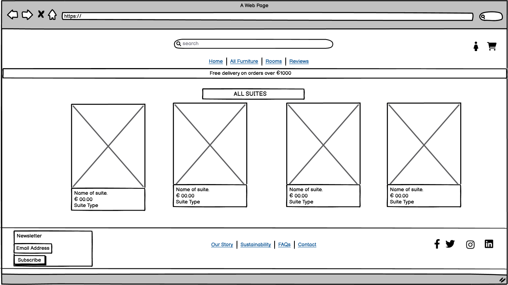 
* This is the 'reviews page' design in the desktop. 
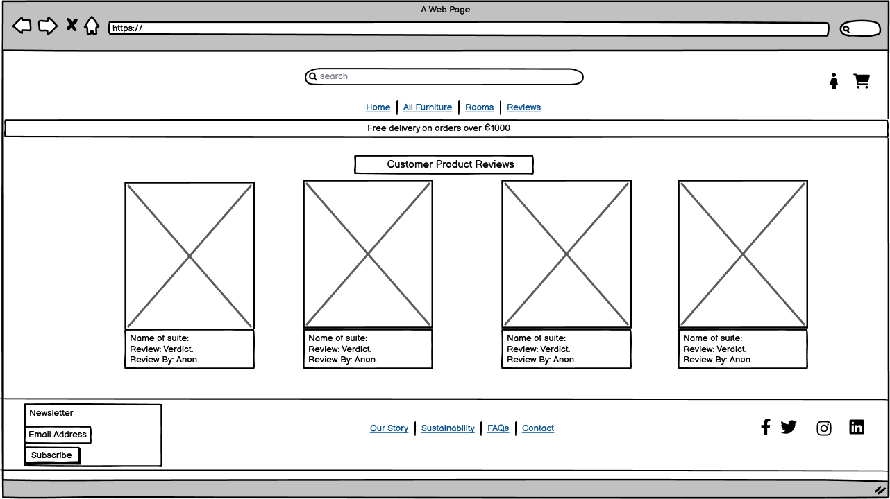 
* This is the 'make review' design in the desktop. 
 
*This is the 'profile' design in the desktop. 
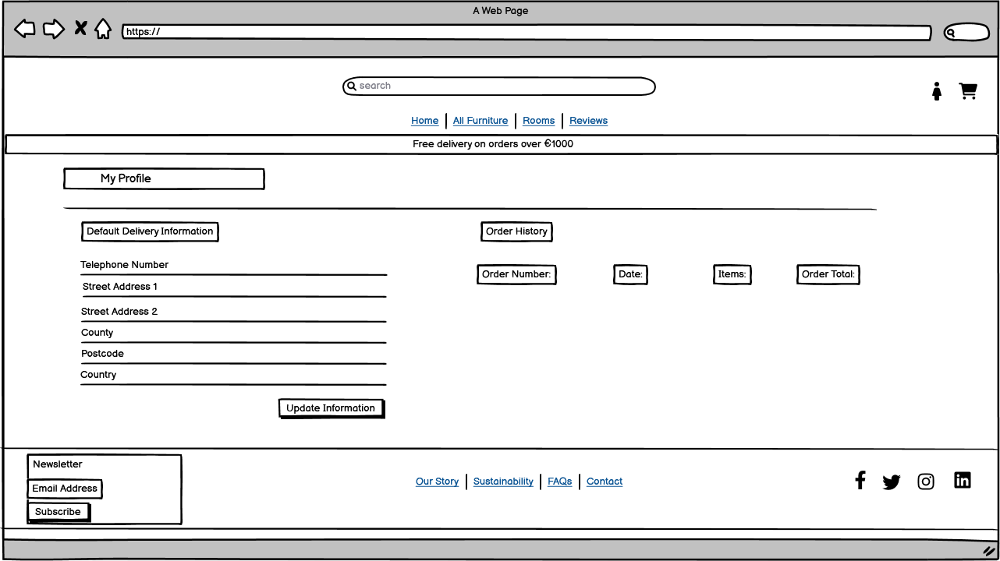 
* This is the 'contact' design in the desktop. 
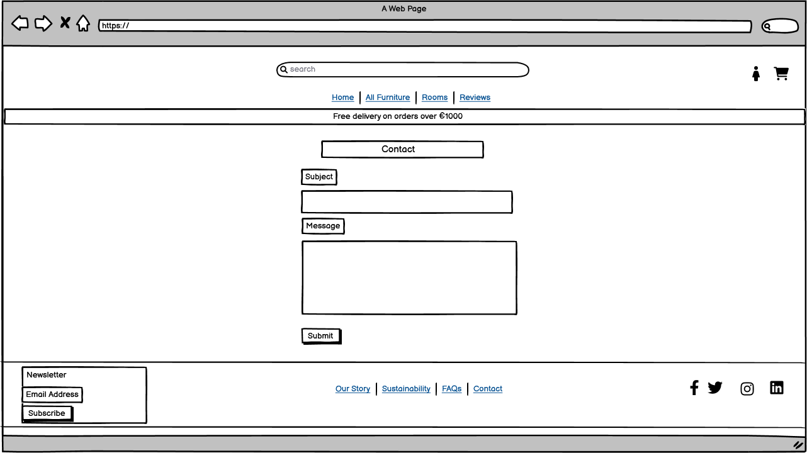 
* This is the 'wishlist' design in the desktop. 
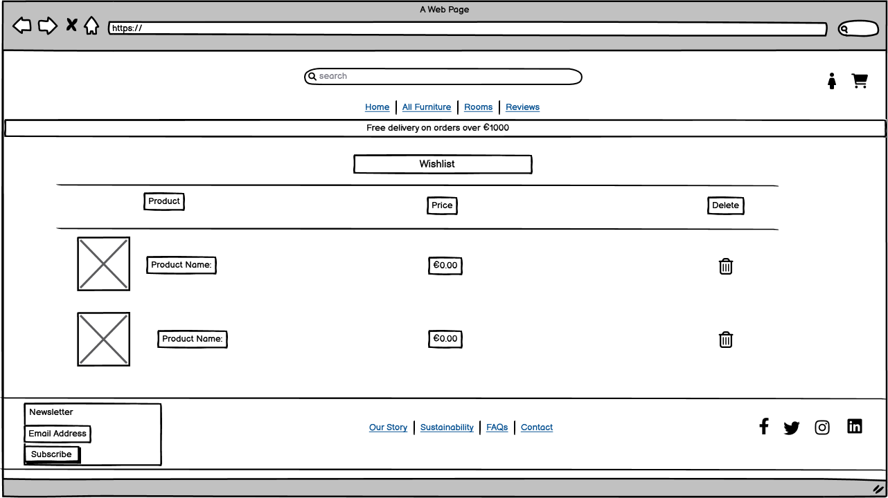 
*This is the 'shopping bag' design in the desktop. 
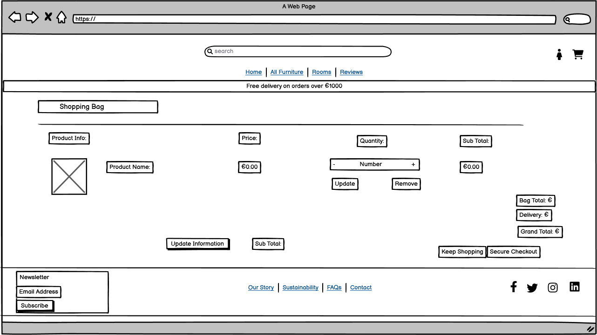 
* This is the 'checkout' design in the desktop. 
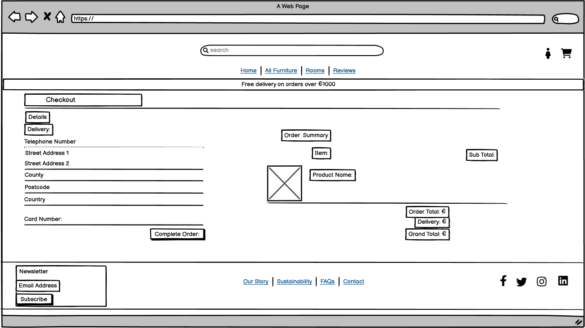 

Mobile-Wireframes
 
* This is the 'home page' design in the mobile. 
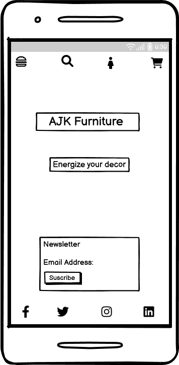 
* This is the 'products' design in the mobile. 
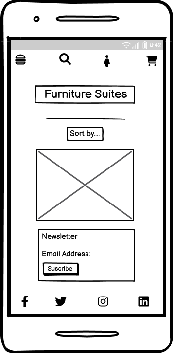 
* This is the 'reviews' design in the mobile. 
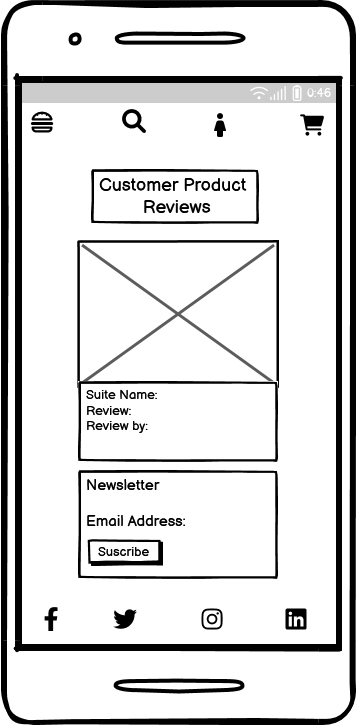 

* [Back to contents](#table-of-contents) 

***
### Color Scheme:
The colors were chosen to complement each other whilst contrasting as well as provide accessiblity. 
 
***
### Typography:
* The Lato font and the font-family-sans-serif were used throughout the app.
***
## Database Schema
* The diagram below shows the relationship between products, catogories, product reviews, users, wishlist. There is only one model with no relationships the contact model.

***
# Business Model

#### Business Overview

The business is a B2C e-commerce platform whose goal is to provide products to it's diverse range of customers through an online store.

The benefits for the business owner are:

1. Easy to scale the business as it grows.
2. No need to set up a physical location.
3. Can cater to customers globally or locally with equal ease.
4. With the sales portal only online changes with the market, either global or local can be ajusted to with relative ease.
5. Relatively low cost in starting up which allows for a larger portion of the budget to be used for customer aquisition. ie Ads / marketing
6. Low price point would encourage impulse buying from customers who may be considering purchasing from the business.

The cons of this business model are:

1. Getting customers initally can be difficult due to saturation in certain industries
2. Establishing a brand from the ground up takes time and immediate results are unlikely without a sound marketing strategy.
3. Getting customers organically takes time so the business would need to manually market the business or use paid advertising.
4. Not having a physical business can make it harder to build trust and loyalty with customers without offering discounts and offers.

A subscription model would not be viable initially. This could only be addressed after a period of time and with the possibility of additional services. 

* [Back to contents](#table-of-contents)
---

#### Site User
User 1: The typical site user would be a male/female who would most likely be a homeowner and wanting to upgrade a whole suite of furniture, kitchen or bathroom. 

User 2: Additional site users might be lanlords/councils/nursing homes wanting to furnish whole houses.

---

####  Goals for the website
The goals for the website are:
- An easy to navigate website with clear purpose
- Provide users with products that meet their expectations
- Allow users to view, read and comment on articles that may help or interest them.
- Allow users to give their review on any product.
- Allow users to add products to a personal wistlist where they can store products that can easily return to.
- Allow users to checkout quickly and easily
- To allow users to create a profile to view past orders and update profile information

---

#### Marketing Strategy
The businesses marketing strategy going forward is:

1. Promote the store through it's facebook business page. This can be viewed in the SEO section.
2. Utilise various social media platforms, and using Google ads and other paid services budget allowing.
3. Have a soft online launch sale to encourage early adoption and purchases from prospective customers
4. Utilizing services such as mailchimp, create a regular newsletter, blog site and create an extensive mailing list.
5. Write meaningful and helpful articles / blog articles to help with SEO ranking in search engines like google.
6. Set up multiple ads with a different product as the cover image, track the click through rate and stick with the high peformers.
7. Depending on budget the business may look at promoting it's custom made products to influencers in the brands niche, offering complimentary goods or a small fee for a shout out  or review. Ideally targetting low to medium influencers with a following of at least 10k in target niche. This would be realistic with a low budget for the business starting off and can start pushing traffic towards the site.
***

### Facebook Page
* A facebook social media page is of vital importance and is recognized as one of the primary marketing tools.
* The facebook page link (The page might be ofline due to facebook policy of not publishing pages not active, therefore there are screenshots below.)

The facebook page can be found [here](https://www.facebook.com/profile.php?id=100093531144565)

 Facebook Screenshots 

 
Screenshot Top

Screenshot Bottom

* [Back to contents](#table-of-contents)

# Features

 Home Page 

 
The Home Page is a portal to the site with site navigation links, footer and the online ecommerce shop title.

 Navigation 

 

The Navigation bar gives the user the options/links in order to navigate the site. The user can see their username if logged on. There is a search function for the products as well as dropdown menus for the products.

The desktop view.

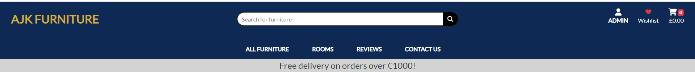

The mobile view.

 Products 

 

The products feature allows the user to view and search all products through various methods including a search input form, scrolling through a list by type, price.

The product can be clicked on and more information on individual products and the option to add to a shopping cart.

 Reviews 

 

The review feature allow new potential customers to view the opinions of previous customers on individual products. It also allows logged in customers to make reviews on individual products as well as edit and delete their own reviews. Staff can also delete reviews but they cannot edit other reviews. Also when a review is deleted there is a requirement to confirm the delete choice.

This function allows the user to view a review and to also paginate through the review pages.

This function allows the user to delete and edit a review that they created it also alows staff to delete any review but not to edit.

This function allows the user to make a review.

This function allows the user to edit a review.

This function allows the user to confirm a delete.

 Contact 

 

The contact option gives the user/customer the opportunity to contact the site owners. This is where they can ask questions and voice concerns that directly concern them. In development state the email is sent to the terminal. 

 

 Shopping Bag 

 

The shopping bag feature allows the user to view their choices and add/remove if they so desire. They can also view the individual/total costs. There is also the option to go to a secure checkout area of the site. It is also in this feature that the discount amount formula is included. This added feature makes it that staff only have to add/change the category of a product for the discount to take effect rather than having to do so for each individual item/product. Also the discount amount can be universally set in settings.py..

There is also a message popup that appears when the user makes a change to their shopping bag to inform them of their change.

 Checkout 

 

The checkout feature allow the user to view a list of their shopping bag including costs. There is a blank form if they are not a registered user. This form is to contain name and delivery details. Within the checkout model a formula was added to workout the delivery cost for each transaction. A fixed delivery charge which can be set in settings.py if the order is below a certain threshold. 

There is also a portion of the form for the customers credit card details.

 Messages 

 

There are various popoup messages that inform the user when they complete an action. These include success, error, info and warning messages.
The Django message feature was used to facilitate this.

Here is an example of a successful addition to a shopping bag.

 Wishlist 

 

This is a feature that allows the user to store products in an online holding area. This enables them to come back later to view where they have the choice to delete the item from the list or to further take a look at the product. This is a tried and proven technique to further sales. Also included is an added menu icon for the user.

Here is an example of a user wishlist.

This is the wishlist icon in the menu.

 Footer/Newsletter 

 

This is a feature that allows the user to access the site owners social media accounts and view and converse via that portal. There is also the opportunity to signup to a newsletter where the user can receive regular information in relation to the products and deals that are upcomming.

This is the footer which is on every site page where possible.

### Newsletter/Mailchimp
### Authentification
***

***
# Technologies Used

* [Django](https://www.djangoproject.com/) - A high level Python web framework.
* [Bootstrap](https://getbootstrap.com/) - A CSS free open source framework used for the front end development.
* [HTML5](https://en.wikipedia.org/wiki/HTML) - A markup language that describes the structure of the web page.
* [CSS3](https://en.wikipedia.org/wiki/CSS) - Provides the styling for the website.
* [JavaScript](https://en.wikipedia.org/wiki/JavaScript) - Provides interactive elements of the website
* [Python](https://en.wikipedia.org/wiki/Python_(programming_language)) - An interpreted, object-oriented language with dynamic semantics.
* [Gitpod](https://gitpod.io/) - Used to create and edit the website.
* [GitHub](https://github.com/) - Used to host the repository.
* [Google Chrome DevTools](https://developer.chrome.com/docs/devtools/) - Used to test responsiveness of web pages and debug.
* [Balsamiq](https://balsamiq.com/) - Used to create the wireframes for the project.
* [Heroku](https://dashboard.heroku.com) - Used to deploy the website.
* [PEP8 Validation](http://pep8online.com/) - Used to validate Python code.
* [HTML Validation](https://validator.w3.org/) - Used to validate HTML code.
* [CSS Validation](https://jigsaw.w3.org/css-validator/) - Used to validate CSS code.
* [JSHint Validation](https://jshint.com/) - Used to validate JavaScript code.
* [drawSQL](https://drawsql.app/) - Used to draw the database schema.
* [Mailchimp](mailchimp.com) - A mail service email marketing and automation service..
* [LambdaTest](https://app.lambdatest.com/console/realtime/browser) - Used to test deployed app on different browers.
* [Color Adobe](https://color.adobe.com/create/color-wheel) - Used to create a color palete.

* [Back to contents](#table-of-contents)
## Libraries
This is a list of libraries used in the project.

* asgiref==3.6.0
* boto3==1.26.145
* botocore==1.29.145
* dj-database-url==0.5.0
* Django==3.2.19
* django-allauth==0.41.0
* django-countries==7.2.1
* django-crispy-forms==1.14.0
* django-storages==1.13.2
* gunicorn==20.1.0
* jmespath==1.0.1
* oauthlib==3.2.2
* Pillow==9.5.0
* psycopg2==2.9.6
* python3-openid==3.2.0
* pytz==2023.3
* requests-oauthlib==1.3.1
* s3transfer==0.6.1
* sqlparse==0.4.4
* stripe==5.4.0
* urllib3==1.26.16

* [Back to contents](#table-of-contents)
***
## Security and Authentification

Specific steps have been taken to ensure the security of users data and the websites integrity. These are as follows;
* The use of an env.py file to store key variables for accessing secure environments i.e. PostgreSQL Database.
* A gitignore file has been incorporated to ensure the env.py file is never committed to production. Therefore retaining the security of these key variables.
* Additionally, these variables are stored within the Config Variables in Heroku to ensure GitPod and Heroku can synchronise securely.
* Cross Site Request Forgery (CSRF) tokens have been applied to all HTML Forms. Their application provides protection from malicious attacks where users maybe performing certain actions or sending data when logged-in.
* Django's inbuilt User Authentication has been applied to several key areas to ensure only authenticated users can add reviews. A further layer of security has been applied to ensure the ability to manage products (Create, Update, Delete) in the front end can only be performed by users with 'Admin' status.
***

## Testing

I have chosen include a series of manual tests with the possibility of unit tests if time allows.

* Each user story is to be tested to ensure requirements are met.
* Browser - Pages are to be tested accross various browsers.
* Accessibility - To be checked accross various devices.
* Code Validation - Various validation tools to check HTML, CSS, Python and Javascript.

For testing results: [Navigate to TESTING.md](TESTING.md)

* [Back to contents](#table-of-contents)#
***

## Bugs
* There was an issue with migrations were running against local SQL development instead of production elephantSQL. A quick solution was to add 'release: python manage.py makemigrations && python manage.py migrate' at the top of the Procfile in order for auto migrate to heroku.
* There was an initial problem with the 'review' app in that it would not render in the 'product detail' template. In order to get the app to work it was taken out of the product app and is now a standalone app. This would possibly want to be addressed at some stage.
* A 500 server error was found to be an error in the wishlist app when a product with no image was added. The solution was a python if/else statement to insert an image if none was present.
* The £ symbol was being sent in the confirmation email instead of the € symbol. A simple error but could have had negative results for the site in relationship with customers.
* [Back to contents](#table-of-contents)
***
## Credits
* The deployment section was taken from another project and customized appropriately. Its detail is will prove invaluable in the future for any user including myself the author of this project.
* [Stackoverflow(answer from 'JCJS')](https://stackoverflow.com/questions/18676156) - How to use the 'choices' field option.
* [Stackoverflow(answer from 'htgull')](https://stackoverflow.com/questions/5959462) -  'verbose names'-For using human names is models.
* [Stackoverflow(answer from '')](https://stackoverflow.com/questions/44022056) - Sets a constraint/validatior for the number of participants.
* [Contact forms/django('Youtube with Stein')](https://www.youtube.com/watch?v=dnhEnF7_RyM) - Creating backend contact form in django.
* [Collectstatic Error('answer from 'Mo Far')](https://stackoverflow.com/questions/36665889) - Removing the 'collectstatic --noinput' error on deployment.
* [Confirm delete error](https://stackoverflow.com/questions/70346755/django-deleting-using-modal-show-and-delete-only-the-first-item-from-the-tabl)
***
### Code and Tutorials
* Code Institute walkthrough project "Boutique Ado" was used as the template with customizations in areas such the models and templates as outlined in the corresponding features section. 
* [Peer code review/Code Institute(Dee68)](https://github.com/Dee68/pp5/) - To see how the README.md file was structured.
* [Peer code review/Code Institute(Gustav Naslund)](https://github.com/GurraNasan/dragons-nest-gaming) - To visualise an eccomerce website and its stucture.

* [Back to contents](#table-of-contents)
***
## Deployment
The project has been deployed to Heroku. Detail of the steps taken to deploy the project can be found [here](DEPLOYMENT.md)

## Acknowledgements
* This website was built as part of the Full Stack Development course from Code Institute. I would like to thank my mentor Ronan McClelland for all his feedback and guidence throughout. Also the Code Institute slack community including tutor support.
* [Back to contents](#table-of-contents)
***
* [Back to contents](#table-of-contents)