# Manual Testing

[Back to README](README.md)

## [Table of Contents](#table-of-contents)
* [HTML](#html)
* [CSS Validator](#css-validator)
* [Lighthouse](#lighthouse)
* [Javascript](#javascript)
* [Python](#python)

### CSS Validator
The CSS validator showed no errors. The css styles in the style sheets should be grouped together for developers editing or updating the code. 
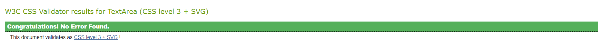 

### Lighthouse
The desktop results are encouraging especially in relation to accessibility (The remaining accessibility issue is related to 'li' in bootstrap navbar.) 
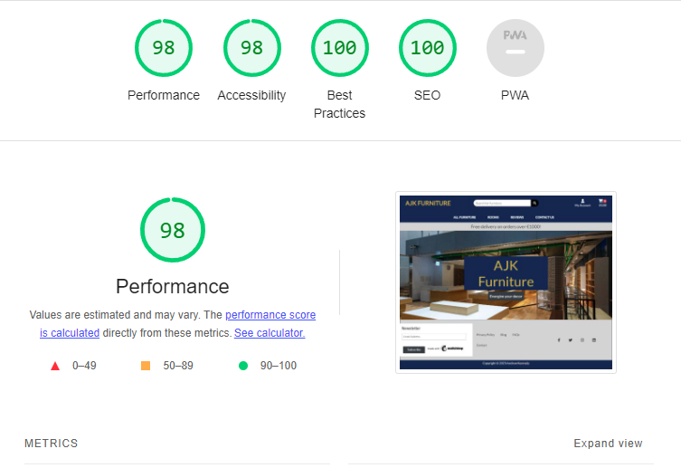 
The  mobile results for are also encoraging expect that there are issues with preformance in that rendering for utilities such as mailchimp and stripe is delaying loading times. This will need to be addressed in the long term. The background image was converted to a 'webp', but this made no difference to the results, although the error was removed from the results. 
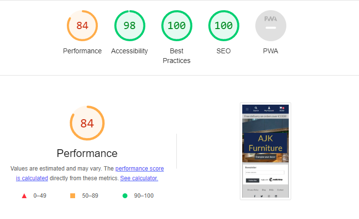 

### Javascript
* Much of the javascript is included in the individual files for seperate files JSHint was used. 
* This was the results from JSHint. 
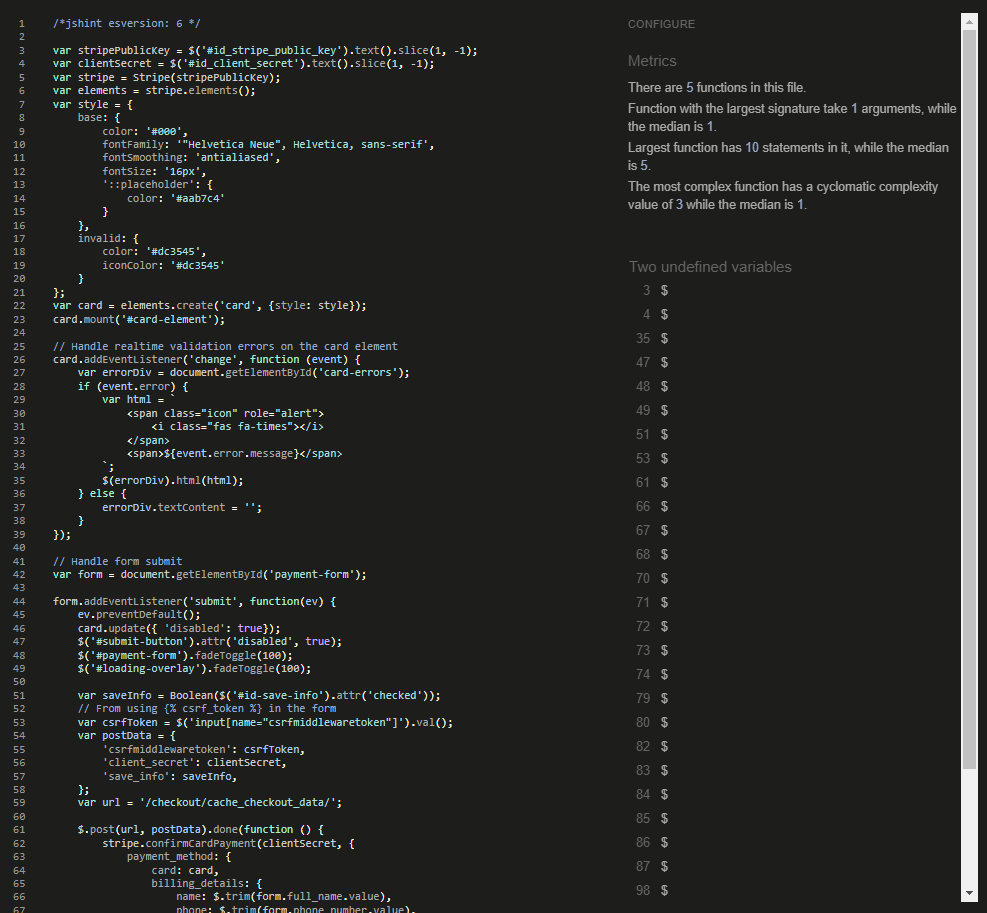 

### Python
* PEP8 Style guide was used for all python code.
* All whitespaces, missing newlines and missing docstrings errors were rectified.
* The CI Python Linter showed no errors. 
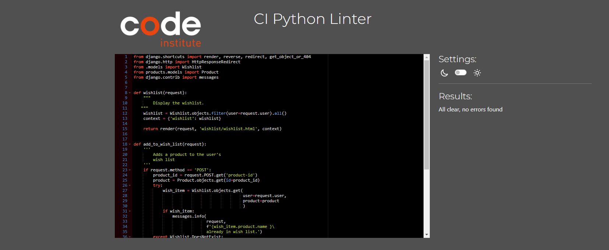 

## Site Navigation 
* This feature is user story: [#2](https://github.com/andyk8872/p5-ecommerce/issues/2) . It enables the user to traverse the site in order to complete their objectives. As well as testing all manual links the site navigation was tested on all sizes via Google Chrome Dev Tools. 
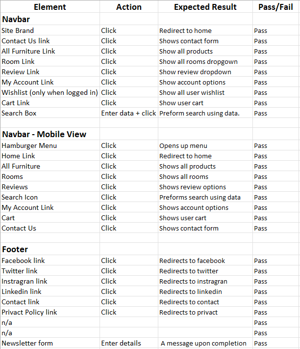 

* Each link redirected to the appropriate page. The signup form in the footer is linked to Mailchimp which when filled out correctly using a valid email subscribed and responded with a success message or error message if incorrect.

* [Back to contents](#table-of-contents)

## Login/Logout/Register

* The site is using 'allauth' for the administration of users and accounts.

## Reviews

* This feature is user story: [#16](https://github.com/andyk8872/p5-ecommerce/issues/16) & [#17](https://github.com/andyk8872/p5-ecommerce/issues/17) 

* Users can make, edit and delete review from this feature. 
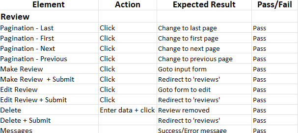 

## Contact

* This feature is user story: [#18](https://github.com/andyk8872/p5-ecommerce/issues/18)

* Users can post a question to the site owners. 
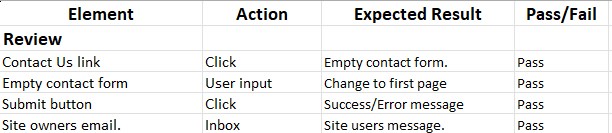 

## Wishlist

* This feature is user story: [#19](https://github.com/andyk8872/p5-ecommerce/issues/19)

* Users can add products to a wishlist for futher use. 
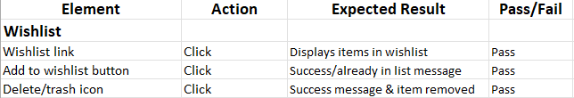 

## Products

* This feature is user story: [#3](https://github.com/andyk8872/p5-ecommerce/issues/3) ,  [#4](https://github.com/andyk8872/p5-ecommerce/issues/4) & [#8](https://github.com/andyk8872/p5-ecommerce/issues/8)

* Users can view/search products and add to wishlist or shopping bag. 
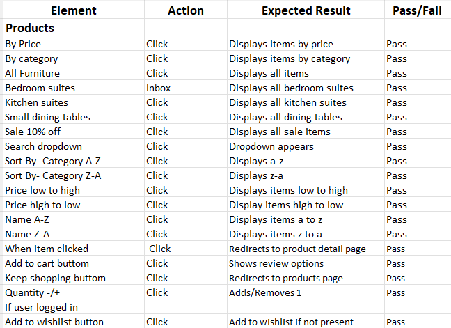 

## Cart

* The feature is user story: [#9](https://github.com/andyk8872/p5-ecommerce/issues/9) , [#10](https://github.com/andyk8872/p5-ecommerce/issues/10) & [#11](https://github.com/andyk8872/p5-ecommerce/issues/11)

* User can view their shopping cart, update and go to checkout. 
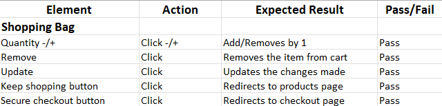 

## Secure Checkout

* The feature is user story: [#12](https://github.com/andyk8872/p5-ecommerce/issues/12) , [#13](https://github.com/andyk8872/p5-ecommerce/issues/13) , [#14](https://github.com/andyk8872/p5-ecommerce/issues/14) , [#15](https://github.com/andyk8872/p5-ecommerce/issues/15)

* User can view their chosen products, fill in their details in order to pay for their items. 
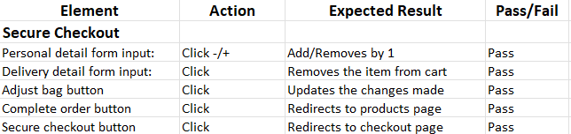 
